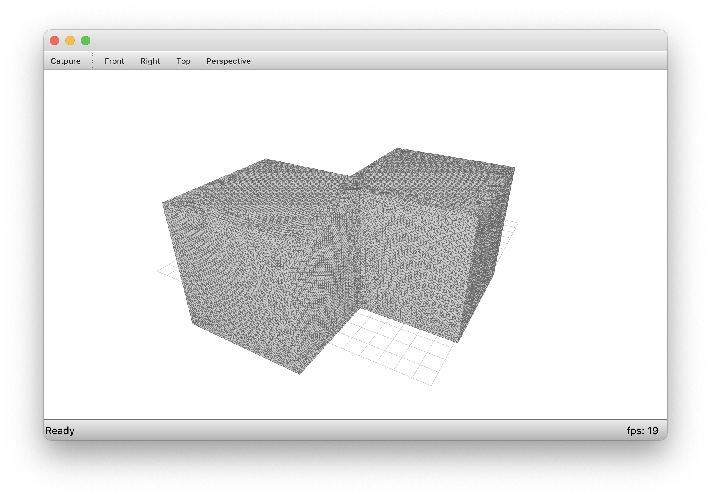
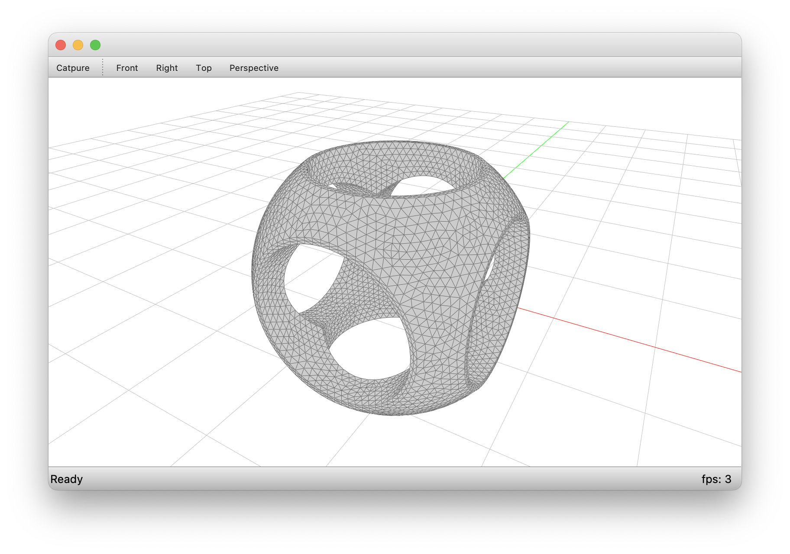

# COMPAS GMSH

**THIS PROJECT IS WIP.**

**CONTRIBUTIONS TOWARDS CREATING A FIRST STABLE VERSION A VERY WELCOME :)...**

----

COMPAS friendly interface for Python-GMSH.

## Installation

```bash
conda create -n gmsh -c conda-forge python=3.8 python-gmsh compas --yes
conda activate gmsh
```

```bash
pip install -e .
```

To install COMPAS View2 for 3D visualisation outside of CAD environments

```bash
conda activate gmsh
conda install -n gmsh -c conda-forge compas_view2
```

## Getting Started

There are a few scripts in the `examples` folder to get started.
`csg1.py` creates the union of two boxes and refines the resulting mesh.
`csg2.py` is the intersection of a box and sphere, union of three cylinders, and difference of the intersection and union...





## License

`compas_gmsh` provides a COMPAS friendly interface to `Python-Gmsh`.
`Gmsh` and `Python-Gmsh` are released under GPL-2.0-or-later.
