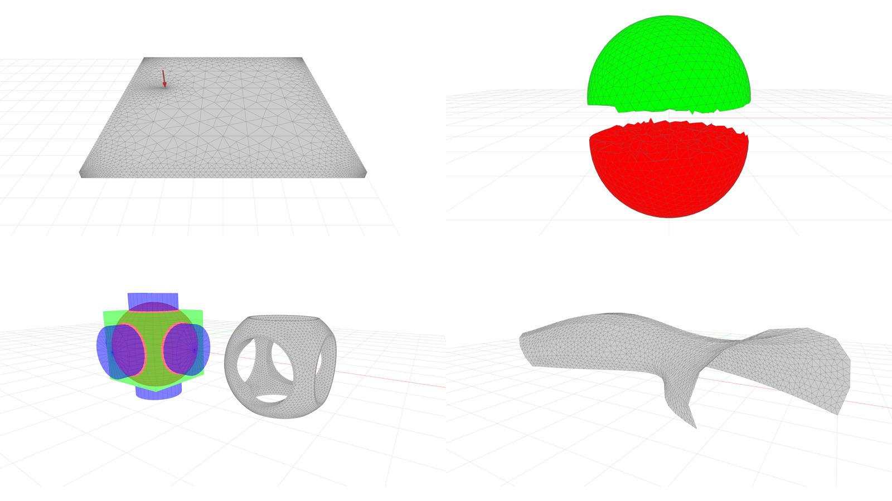

# compas_gmsh

`compas_gmsh` provides an easy-to-use
COMPAS-based wrapper for the Python bindings of [Gmsh](https://gmsh.info/),
which is an open source 3D finite element mesh generator with a built-in CAD engine and post-processor.
With `compas_gmsh`, you can easily generate high-quality meshes for COMPAS primitives, shapes, surfaces, breps, and mesh data structures.
